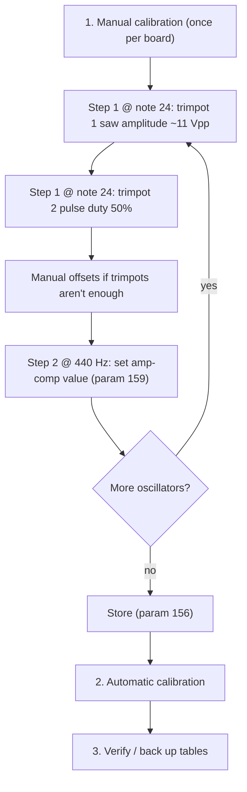

# DCO Calibration Procedure

The full workflow for bringing up a board's oscillators: the one-time **manual trim** stage that establishes a known-good baseline, and the **automatic calibration** that builds the per-oscillator amp-comp tables from that baseline.

How the algorithms work internally: [`AUTOTUNE.md`](AUTOTUNE.md). Code structure: [`AUTOTUNE_REFACTORED.md`](AUTOTUNE_REFACTORED.md).

---

## Overview

The manual stage matters because everything downstream assumes it: the automatic calibration starts from the manually established operating points and extends the curve from there. Once trimmed, the analog side should not drift far, so this is normally done only on first bring-up (or after hardware changes).

## The two manual steps

Manual calibration has two steps, selected with `PARAM_MANUAL_CALIBRATION_STEP` (**158**, reset to step 0 on every manual-cal entry):

| Step | Runs at | What you adjust | What it anchors |
|------|---------|-----------------|-----------------|
| **0** (trim) | `manual_DCO_calibration_start_note` (MIDI 24, ~32.7 Hz) | The two hardware trimpots (+ manual offset if needed) | The low-note baseline that PW calibration and the `CLASSIC` amp method start from |
| **1** (440 Hz anchor) | 440 Hz (`manual_cal_reference_note` = 81; the autotune note tables sit an octave below the MIDI numbers of the same name, see the comment on the constant) | The absolute amp-comp value `PARAM_AMP_COMP_440` (**159**) — no hardware touched | The `(440 Hz, ampComp440)` anchor point of the `FREQ_TRACE` amp method |

At 440 Hz duty readings need only ~3 waveform periods, so the gap readout refreshes ~50×/s and step 1 feels live.

---

## 1. Manual calibration stage

### Entering manual calibration

- From the panel / Input board UI, or from the DCO-CONTROL-PANEL host tool (Calibration tab → manual cal): send `PARAM_MANUAL_CALIBRATION_FLAG` (**151**) = 1. This always starts in step 0.
- Select the oscillator under trim with `PARAM_MANUAL_CALIBRATION_STAGE` (**152**) = 0..2. Only that oscillator runs; the others are muted.
- While active, the board continuously measures the pulse duty and reports it:
  - USB serial: `[MANUAL_GAP] note=… DCO=… gapUs=… dutyErr(%)≈…` (or `TIMEOUT`),
  - and as `PARAM_GAP_FROM_DCO` (**154**, duty error % × 100) to the Input board, which relays it to the screen as "GAP".

### Step 0, trimpot 1 — saw amplitude

Adjust the first multiturn trimpot until the saw output is **≈11 V peak-to-peak**:

- With a scope: watch the saw output directly.
- Without a scope: feed the saw output into an audio interface and use a software oscilloscope (e.g. Reaper's bundled JS oscilloscope). Raise the trimpot until one edge of the saw starts to **clip**, then back it off slightly so the full ramp is visible again.

### Step 0, trimpot 2 — pulse duty 50%

Adjust the second multiturn trimpot until the pulse wave duty cycle is as close to **50%** as possible:

- Easiest: watch the live duty readout (screen "GAP" value or `[MANUAL_GAP] dutyErr(%)` on serial) and trim toward 0.
- Alternatively: scope the pulse output, or use the pulse output with the audio-interface oscilloscope.
- The `FREQ_TRACE` auto-calibration re-measures this operating point and prints its deviation from the nominal note in cents (`[FREQ_TRACE_MANUAL] … dev=… cents`), so a trim that has drifted shows up on the next run.

### Step 0, manual offset — when the trimpots aren't enough

If a trimpot runs out of range, or a later calibration needs a small correction without touching the hardware, adjust the per-oscillator **manual calibration offset**:

- `PARAM_MANUAL_CALIBRATION_OFFSET` (**153**) sets the offset for the currently selected stage (added on top of `initManualAmpCompCalibrationVal`).

### Step 1 — amp-comp value at 440 Hz

Switch to step 1 with `PARAM_MANUAL_CALIBRATION_STEP` (**158**) = 1. The selected oscillator now runs at 440 Hz.

- Adjust `PARAM_AMP_COMP_440` (**159**) — the absolute amp-comp value — until the duty readout is as close to 0 error as possible, exactly like the trimpot-2 trim but purely in software.
- On first entry for an oscillator (stored value still 0) the firmware seeds a starting guess by scaling the step-0 operating point with the frequency ratio, so the oscillator starts near 50% rather than dead.
- A measured curve puts a true 440 Hz somewhere around a tenth of `DIV_COUNTER` (14000), so expect four figures — the panel slider spans **700..2800** (`DIV_COUNTER` × 0.05 .. × 0.2) for usable resolution around that. The firmware accepts 0..`DIV_COUNTER`, so a board outside the slider's range can still be driven over MIDI or from a stored table; the panel logs `[cal] osc n amp comp @ 440 Hz is …` when what it recalled does not fit on the slider.
- This value is a **seed**, not a verdict: `FREQ_TRACE` re-measures it at the start of every run and writes back a correction if it was off (`[FREQ_TRACE_ANCHOR] … stored=… refined=…`). Getting it roughly right is enough.

### Optional — duty trim against a scope

Only needed if a scope on the pulse output disagrees with the board's duty readout, which happens because the cal-sense pin is a digital input reading its own thresholds while the scope measures the analog pulse at its own 50% level. A constant offset in a `[CAL_VERIFY]` sweep (see below) is the same symptom.

- With the scope on the pulse output of the selected oscillator, adjust `PARAM_AMP_COMP_DUTY_OFFSET` (**161**, panel slider "Duty trim (0.01%)", range ±5.00% in hundredths of a percent) until the scope reads 50%.
- Both amp-comp methods and the manual duty readout then aim at 50% + this trim, so every point a later auto-cal stores lands at a true 50% on the output. Default 0 = the historical behaviour.

### Repeat per oscillator, then store

Switch `PARAM_MANUAL_CALIBRATION_STAGE` to the next oscillator and repeat both steps. When all oscillators are done:

- `PARAM_MANUAL_CALIBRATION_STORE` (**156**) persists the manual offsets, the 440 Hz values (`ampComp440[]`) **and** the duty trims (`ampCompDutyOffset[]`) to LittleFS. All are loaded at boot; offsets are echoed to the Input board (`PARAM_MANUAL_CALIBRATION_OFFSET_FROM_DCO`, **155**) when entering manual cal.
- Exit manual calibration (**151** = 0).

---

## 2. Automatic calibration

The board runs two independent stages, both blocking on core 1:

- **PW calibration** (voice 0, once): PW center (50% duty), then low/high PW limits (≈2% / ≈98% duty). Results persist to LittleFS.
- **Amp-comp tables** (per oscillator): builds 22 `[frequency, amp comp]` pairs each and persists them (`update_FS_voice`). The bottom pair is measured, not extrapolated: the oscillator is driven at amp comp **0** and the frequency is bisected until the duty is 50% again, so the curve's low anchor is a real operating point. If there is no usable signal at amp 0, the previous extrapolated estimate is kept. (`FREQ_TRACE` measures it as the last step of its own trace, the classic method right after its table is built.)

Either stage runs on its own. The value of `PARAM_CALIBRATION_FLAG` (**150**) picks which, matching the board's calibration menu tabs:

| Value | Stage | DCO-CONTROL-PANEL button | Board menu tab |
|-------|-------|--------------------------|----------------|
| **1** | Amp-comp tables only | "Amp comp" | AUTO CALIBRATION |
| **2** | PW center + limits only | "PW" | PW CALIBRATION |
| **3** | Both, PW first | "Full" | FULL CALIBRATION |

An amp-only run does not touch PW: it drives the pulse from the PW center already stored in the filesystem, so a PW pass is only needed on first bring-up or after hardware changes. Any run ends by reloading the tables (`init_FS`) and rebuilding the runtime lookup (`precompute_amp_comp_for_engine`).

### Normal and fine runs

The same three stages run at two measurement profiles, chosen by the value: **1/2/3 = normal**, **5/6/7 = fine** (panel: tick **Fine (refine stored table)** next to Stop, and the three buttons send the higher values). The board's own calibration menu always sends 1/2/3, so fine mode is panel-only for now.

- **Normal** builds the table from scratch and measures as fast as the hardware allows: a 25 ms averaging window (6..32 segments), 0.05% duty acceptance, and a single re-measurement of each converged point. This is what you want for bring-up and after any hardware change.
- **Fine** does not rebuild anything. Every amp-comp value in the stored table is kept and only the frequency it really sits at is re-measured, with a 60 ms window (12..64 segments), 0.02% acceptance and a 5-candidate × 3-reading re-measurement per point. Because each search starts from the previous answer, there is no anchor, no bootstrap and no guessing — it is purely a precision pass over a table that already exists.
- Fine therefore **needs a calibrated board**: on a table that was never calibrated (or only seeded) it prints `[CAL_REFINE_GUARD] … run a normal calibration first` and keeps what is there.
- The normal profile is the boot default, and any run at 1/2/3 sets it back.

The usual sequence on a new board is: manual steps, one **Full** run, check `[CAL_REPORT]`, then a **Fine** amp-comp run when you want the last fraction of a percent. Later, a fine run is also the cheapest way to bring a drifted table back without disturbing its shape.

### Cancelling a run

Send `PARAM_CALIBRATION_FLAG` (**150**) = 0 — the **Stop** button beside the run buttons on the panel's Calibration tab. The calibration loops poll the request, so the run stops within about one duty measurement:

- The stage that was interrupted (PW center/limit search, or the current oscillator's amp table) is **discarded** — its previous values are kept.
- Stages that finished before the cancel (e.g. earlier oscillators) keep their new results, which were already persisted.
- The run ends with `[DCO_CAL] cancelled by user` on serial, reloads the persisted tables and returns to normal operation.

Manual calibration mode needs no special handling: unchecking "Manual calibration mode" (param 151 = 0) exits it immediately.

### Amp-comp methods (A/B selectable)

Two methods are available for building an amp-comp table from scratch (a fine run re-measures whatever is stored and ignores the method). Pick one on the DCO-CONTROL-PANEL Calibration tab ("Amp-comp calibration method"), which sends `PARAM_DEBUG_COMMAND` (**160**):

| Debug cmd | Method | How it works |
|-----------|--------|--------------|
| **34** | `CLASSIC` (default) | Per note: fix the frequency, search the integer amp-comp value until duty ≈ 50% (interpolated initial guess, sign-change detection, ±1/±2 stepping) |
| **35** | `FREQ_TRACE` | Per point: fix the amp comp, **search the frequency** until duty = 50%. It starts from the two points you set by hand — the trimpot note and the stored `(440 Hz, ampComp440)` anchor, which it re-measures and corrects — adds a cluster of 4 probes above/below the anchor (±3 and ±6 semitones of amp comp), derives the rung spacing from that model, traces the curve outward in both directions, and measures the full-amp and amp-comp-0 endpoints last (the latter by scanning a band well below the lowest rung for a bracket around 50% duty). **Requires manual step 1** — refuses to run (`[FREQ_TRACE_GUARD]`) while the anchor is unset |

`FREQ_TRACE` is faster (the search measures its modelled seed first and then interpolates, so a point usually costs a handful of probes, most of them at mid/high frequencies) and its anchors are exact — frequency resolution from the PIO clock divider is near-continuous, so there is no amp-comp quantization error baked into the stored points. It also verifies the manual trim: the deviation of the trimpot note from its nominal frequency is printed in cents. See the design section in [`AUTOTUNE.md`](AUTOTUNE.md).

The selection is runtime-only: at every boot the board falls back to the `AUTOTUNE_AMP_METHOD_DEFAULT` build flag in [`DCO.ino`](../DCO.ino), which ships as `CLASSIC` until `FREQ_TRACE` is validated on hardware. Send 34/35 again after a reset, and check `amp_cal=` on the profiler `engine:` line (`PARAM_DEBUG_COMMAND` 10) when in doubt.

### What to expect on serial

- The run opens with `[DCO_CAL] scope: AMP|PW|FULL precision: NORMAL|FINE`, followed (when the amp stage will run) by either `[DCO_CAL] amp-comp method: CLASSIC|FREQ_TRACE …` or, in fine mode, `[DCO_CAL] amp-comp stage: refining the stored tables …` — check these first if the 440 Hz anchor seems ignored (it is only used by `FREQ_TRACE`, and never by a fine run).
- PW stage: `[PW_CENTER_COARSE]` / `[PW_CENTER_BISECT]` / `[PW_CENTER_RESULT]`, then `[PW_LOW_RESULT_V2]` / `[PW_HIGH_RESULT_V2]`.
- Classic amp stage: per-note `Calibration note …` blocks with `[DCO_AMP_SCAN]` lines (debug ≥ 2), ending in `Best calibration voltage`.
- Freq-trace amp stage, in order: the anchor `[FREQ_TRACE]` line; `[FREQ_TRACE_MANUAL] … nominal=… dev=… cents` for the trimpot note (a large deviation means that trim drifted); `[FREQ_TRACE_ANCHOR] … stored=… refined=… dev=… cents` for the re-measured 440 Hz anchor (plus a second line when the stored value was corrected and persisted); four `[FREQ_TRACE_BOOT]` bootstrap-cluster lines (fixed amp, found freq); `[FREQ_TRACE] … ladder interval=N semitones anchorPair=k span=… octaves`, the spacing derived for this oscillator; per-rung `[FREQ_TRACE]` lines (target freq, fixed amp, found freq, plus a `retry` line where a rung was corrected); finally the `top endpoint` and `bottom endpoint` lines. Each carries `gapUs= dutyErr=…% probes=… settle=…` — the error actually achieved at that point, how many duty measurements it took, and how many of those were spent waiting for the waveform to stop moving after a frequency change.
- The classic method instead prints `[LOWEST_FREQ] DCO=n amp=0 freq=… gapUs=…` after its table for the measured bottom anchor (or the reason the previous estimate was kept).
- Fine amp stage: one `[CAL_REFINE] … pair=p amp=… stored=… -> found=… moved=… cents` line per stored pair, then a `measured=N/M`, average duty error and largest-move summary. A pair that moved by a lot is one the previous run got wrong.
- A probe sets its frequency in one write and then waits: stepping toward it would keep changing the frequency before a whole waveform has come out of the previous one, which is what the duty measurement needs. What keeps those writes small is the search itself — it measures its seed first and then moves by at most 100 cents below 100 Hz (200 up to 440, 400 above) until it can interpolate. After a move, each reading is confirmed by a second one before it is used, so a slow oscillator is given as long as it takes. A high `settle=` count means this oscillator is slow to follow; a `[FREQ_SETTLE]` line (autotune debug level 2 or higher) means the readings never agreed within the budget, which is the case for raising `settleMaxChecks` or `settlePeriods` in [`autotune_constants.h`](../autotune_constants.h).
- Underneath all of it, at autotune debug level 2 or higher, every single duty reading prints `[GAP_MEASURE] mode=… note=… freq=… AMP=…`, and every probe of a frequency search prints `[FREQ_BISECT] amp=… f=… gap=… dutyErr=…`. Use `freq=` (the frequency actually driven) to follow a run, not `note=`: during a `FREQ_TRACE` search the note number is left wherever the calibration last set it.
- Each oscillator ends with the 44 raw `calibrationData` values, the `[CAL_REPORT]` table and `DCO n calibration finished.`

### Reading `[CAL_REPORT]`

One block per oscillator: a header with the method and the precision, a row per table pair with the frequency, the amp comp, the duty error achieved when that pair was measured, the raw gap, the one-count floor and where the pair came from (`rung`, `anchor`, `endpoint-full`, `endpoint-amp0`, `manual`, `refined`, `filled`, `sentinel`), then the endpoints/span line and an average/worst line.

- `dutyErr%` of `-` means the pair was never measured (padding or synthetic fill); `measured=N/22` counts the real ones.
- `1cnt%` is how much duty one count of amp comp moves at that point. If `dutyErr%` is already below it, the point is as good as the hardware allows — that is why the lowest notes stay coarse (at ~30 counts of amp comp, one count is over a percent of duty).
- A worst point that stands out is worth a second look at that frequency with `[CAL_VERIFY]`.

### Verification sweep

`PARAM_DEBUG_COMMAND` **36** (panel: Calibration tab → Dev tables → "Verify sweep") replays the stored tables the way the engine uses them: every 3 semitones it takes the amp comp from the runtime lookup (interpolated, not the table row) and measures the duty, printing `[CAL_VERIFY] DCO=n note=… freq=… amp=… dutyErr=…% gapUs=… 1cnt=…%` plus an average/worst line per oscillator. It changes nothing and can be cancelled with `PARAM_CALIBRATION_FLAG` = 0.

- Constant error across the range → frame-of-reference offset; dial the duty trim (**161**) against a scope and re-run auto-cal.
- Error peaking between table breakpoints → interpolation; more calibration points would help.
- Error growing toward the low notes and tracking `1cnt=` → the amp-comp quantization floor; nothing to fix in software.

---

## 3. Verify and back up

- **Back up**: DCO-CONTROL-PANEL → Calibration tab → **Calibration backup → Dump board → file…** pulls all tables into a `dco3-cal` JSON. Keep a known-good dump per board.
- **Compare**: after a new calibration (or firmware change), dump again and compare the amp-comp curves against the known-good file — points should differ only within measurement noise.
- **Restore**: **Load file → board…** bulk-pushes the tables back (useful to recover from a bad run without re-calibrating).

## Troubleshooting

- `[MANUAL_GAP] TIMEOUT` + `[CAL_SENSE]` lines: the cal-sense input isn't seeing a valid signal — see "Cal-sense bench checks" in [`AUTOTUNE.md`](AUTOTUNE.md) for the pin-level decision table.
- Auto-cal aborts / `[DCO_AMP_GUARD]` messages: the search hit a guard (no signal, unreachable tolerance). Check the manual trim baseline first — the automatic stage assumes the manual anchor is good.
- `[FREQ_TRACE_GUARD] … 440 Hz anchor not set`: the `FREQ_TRACE` method needs manual step 1 done and stored for that oscillator (params 158/159 then 156). The previous table is kept.
- `[CAL_REFINE_GUARD] … run a normal calibration first`: fine mode found no usable stored table for that oscillator (too few pairs, non-monotonic, or flat/seeded). Run a normal amp-comp pass, then refine.
- Fake tables (`PARAM_DEBUG_COMMAND` 30) are development placeholders only; never a substitute for a real calibration pass.
